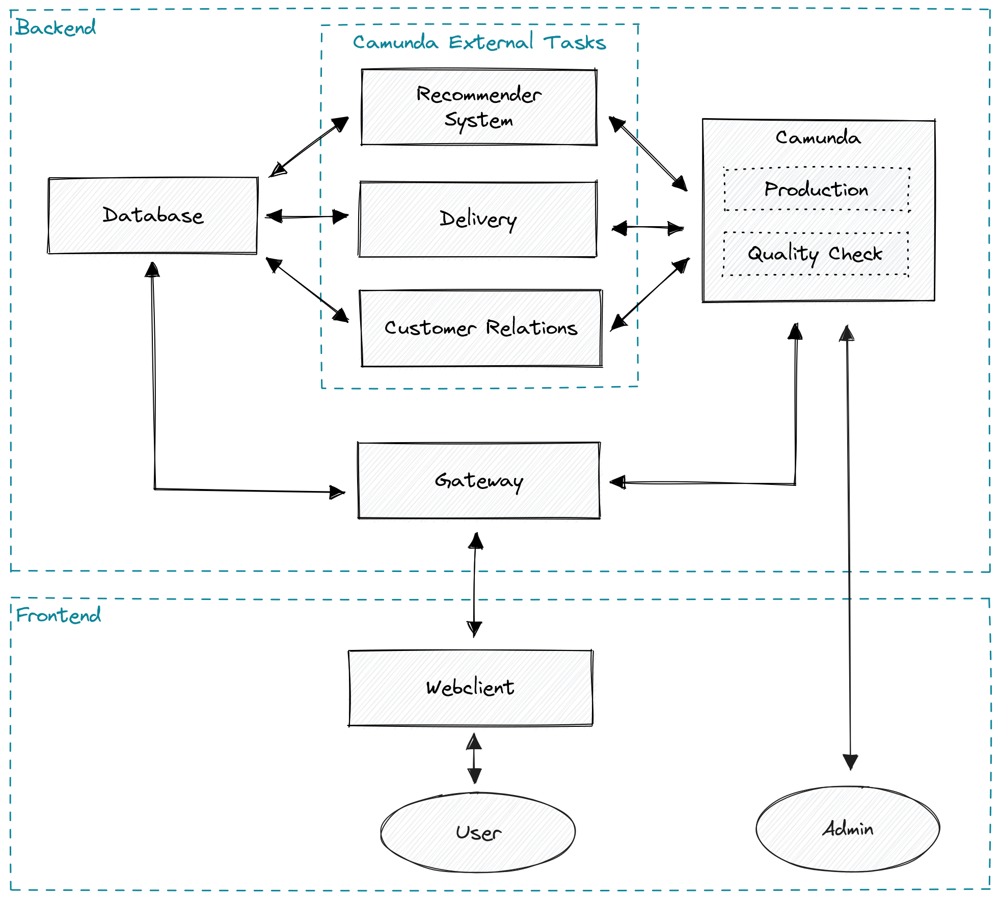

# ShampooMe

ShampooMe is a web-shop for personalized shampoos.

This project is a prototype with a focus on the business process. It uses the process management tool [Camunda](https://camunda.com/) as backbone.

## Getting Started

This project requires [Docker](https://www.docker.com/get-started) to be installed. 

Simply start the project by executing the following command in the project directory:

```bash
docker-compose up
```

The main website should then be up and running at `localhost:4200`.
It may take a few seconds for everything to start.

## Sites

The following sites can be reached:

* `localhost:4200` UI of the Application
* `localhost:8080` API of the Application
* `localhost:8081` Process Management Tool aka Camunda (user: `demo`, password: `demo`)
* `localhost:8082` Database Administration Tool (user: `user`, password: `password`, database: `mydatabase`)

## Process

Since the process is such an integral part of this project, here is a simplified version. 


The detailed version can be found in the folder `processes`.
For easier development there is the process `shampoome-process-test.bpmn`, with shorter delays.
If you want to change the current process, replace the `.bpmn` in `backend/camunda/src/main/resources` with the desired new process.

## Architecture



The project is a classic web application, with frontend & backend. It consists of multiple components, and is designed to be distributed i.e. each component can be on a different machine.

All backend components (excluding the database) are Java SpringBoot applications using Maven.

### Webclient

Main UI of the application. `Users` can (1) get a shampoo recommendation, (2) order a shampoo, (3) check the order status, and (4) send feedback.

### Gateway

Provides an HTTP API and is the access point aka gateway to the backend. It handles all requests from the frontend, validates these requests, and routes them to the database and/or camunda.

### Recommender System

Listens on camunda tasks and accordingly (1) determines shampoo ingredients, or (2) saves an order to the database.

### Delivery

Listens on camunda tasks and accordingly (1) update the order status, or (2) simulate that a package is lost 10% of cases.

### Customer Relations

Listens on camunda tasks and accordingly (1) update the order status, or (2) save feedback & KPIs to the database.

### Camunda

Provides a UI for `admins` to see all current process instances, and for managing the quality check.
It also simulates delays for production & delivery tasks.

### Database

Persists orders and feedback. `mariadb/init.sql` contains a script to initialize the database.

## Credits

This project was created by students as part of a lecture at the *Vienna University of Technology*.

Nihad Abou-Zid, Sebastian Fürndraht, Tobias Henöckl, Parinaz Momeni Rouchi, Lukas Wieser · 06.06.2023
